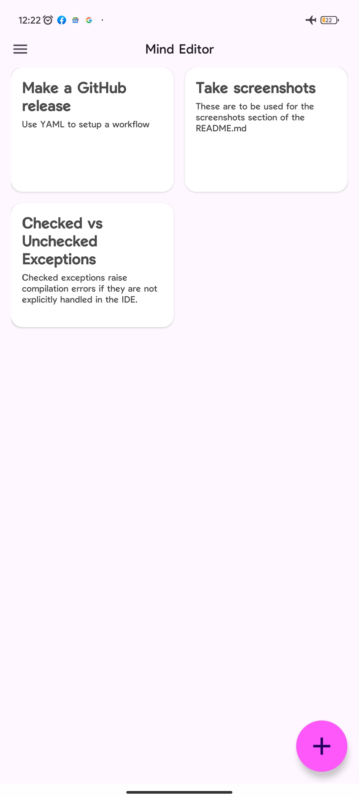
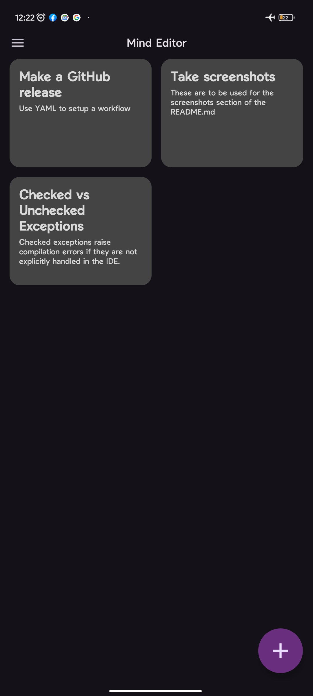
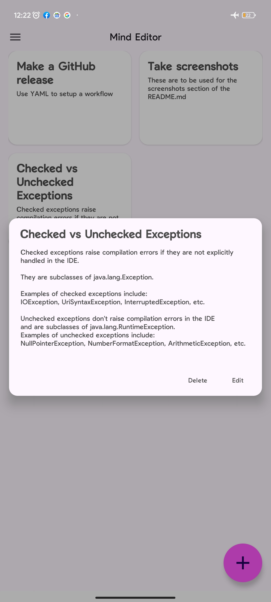
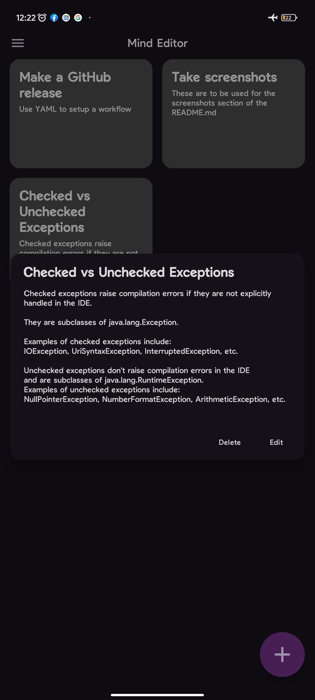
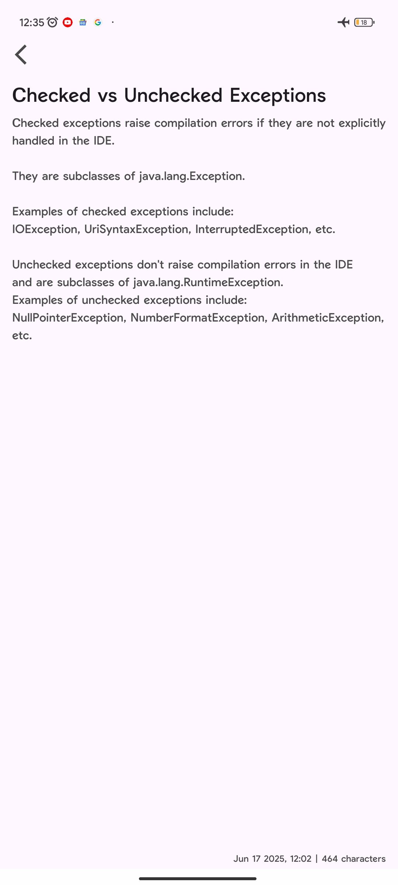
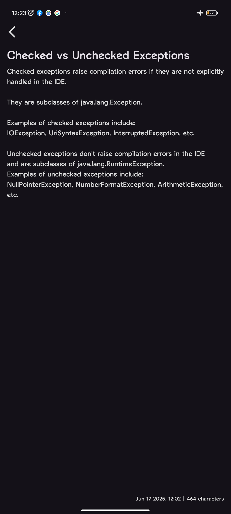

# MIND Editor

*A modern, open-source note editor app for Android focused on simplicity, privacy, and collaboration*.

[](LICENSE)

---

## Table of Contents

- [Features](#features)
- [Screenshots](#screenshots-v100)
- [Getting Started](#getting-started)
- [Downloads](#download-the-app)
- [Installation](#installation)
- [Usage](#usage)
- [Contributing](#contributing)
- [License](#license)
- [Acknowledgements](#acknowledgements)
- [Changelog](#changelog)
- [Roadmap](#roadmap)
- [Contact](#contact)

---

## Features

- 📝 Simple and intuitive note editing
- 🌙 Light and dark themes
- 🔐 No special permissions
- 🚫 Fully offline
- 🤝 Open for contributions

---

## Screenshots (v1.0.0)

| Light mode                                       | Dark Mode                                      |
|--------------------------------------------------|------------------------------------------------|
|  |  |
|      |      |
|       |       |

<sub>UI in both light and dark mode.</sub>

---

## Getting Started

### Prerequisites

- Android Studio (latest version recommended)
- Android SDK 24 or higher
- Java 11+

---

## Download the app

For now,
the app is only available via [GitHub releases](https://github.com/Andruid929/mind-android/releases).

---

## Installation

1. **Clone the repository:**
    ```bash
    git clone https://github.com/Andruid929/mind-android.git
    ```
2. **Open in Android Studio*.*
3. **Build and run** on your device or emulator.

---

## Usage

- Launch the app
- Click the "+" icon to reveal the new note button
- Add your note

---

## Contributing

One of the main reasons for making this repo public was for contributions!
Please see [CONTRIBUTING.md](CONTRIBUTING.md) for guidelines.

1. Fork this repo
2. Create your feature branch (`git checkout -b feat/your-feature`)
3. Commit your changes (`git commit -am 'Some feature commit message'`)
4. Push to the branch (`git push origin fea/your-feature`)
5. Open a pull request

---

## License

This project is licensed under the GNU General Public License v3.0 - see the [LICENSE](LICENSE) file for details.

---

## Acknowledgements

- [Android documentation](https://developer.android.com/docs)
- Special thanks to all [contributors](CONTRIBUTORS.md)!

---

## Changelog

See the [changelog](CHANGELOG.md) for detailed list of updates and version history.

---

## Roadmap

Check out [ROADMAP.md](ROADMAP.md) for planned features and ideas for Mind Editor.

---

## Contact

Created by [Andrew Jones](https://github.com/Andruid929) — feel free to reach out via GitHub issues or discussions.